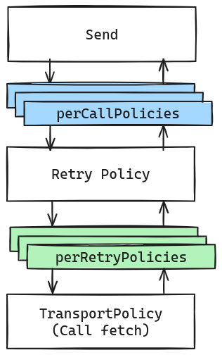

# HTTP Pipeline

This library provides a way to write clean and reliable HTTP Clients, instead of writing complex `fetch()`. It uses the same principle as those available in the HttpPipeline of the [`Azure.Core`](https://www.nuget.org/packages/Azure.Core) from the [.NET Azure SDK]( https://github.com/Azure/azure-sdk-for-net). More details are explained in [this video](https://www.youtube.com/watch?v=0tKXe1wOqI8)

## Simple request

Simple example, using the `HttpMessageBuilder` to build the request easily, then send it through the pipeline, and then parse the response and throw if the server responded with an error.

### Example

```ts
type Response = {
    id: number;
    // ...
}

class MyAwesomeClient {
    constructor(
        private readonly httpPipeline: HttpPipeline,
        private readonly httpMessageResponseUtil: IHttpMessageResponseUtil,
    ) {
    }

    async createSomething(): Promise<Response> {
        const message = new HttpMessageBuilder()
            .withMethod('POST')
            .withUrl('/api/blogs')
            .withQueryString('test', 'true')
            .withHeader('Authorization', 'Bearer some-auth-token')
            .withJsonBody({
                title: 'some-title',
                content: 'some-content'
            })
            .build();

        await pipeline.send(message);
        return httpMessageResponseUtil.parseJsonResponse<Response>(message);
    }
}

let options = new HttpPipelineOptions(); // Configure policies, retry etc...
const pipeline = new HttpPipelineFactory().build(options);
var client = new MyAwesomeClient(pipeline, new HttpMessageResponseUtil());
```

## Policies

Policies are like middleware in ASP.NET Core or Interceptors in Angular. They allow execution of code before/after each request



You can register a policy to be called once per request, or once per retry.

For example, this allows you to add a custom header or handle all common errors from the server at one place.

### Example

```ts
class AuthenticationHttpPipelinePolicy extends HttpPipelinePolicy {
    static propertyKey: symbol = Symbol();

    async process(message: HttpMessage, pipeline: HttpPipelinePolicy[]): Promise<void> {
        let authentication = message.properties[AuthenticationHttpPipelinePolicy.propertyKey] as Authentication;
        if (authentication) {
            switch (authentication.type) {
                case 'JWT':
                    message.request.headers['Authorization'] = 'Bearer ' + authentication.token;
                    break;
                case 'ApiKey':
                    message.request.headers['Authorization'] = authentication.apiKey;
                    break;
                // .... Other complex scenario, like request that need to be signed, with timestamp etc...
            }
        }
        await this.processNext(message, pipeline);
    }
}
```

Then you need to register a policy like this:

```ts
let options = new HttpPipelineOptions();
options.perRetryPolicies.push(new AuthenticationHttpPipelinePolicy());
const pipeline = new HttpPipelineFactory().build(options);
```

And then you can configure the authentication to use like this:

```ts
const message = new HttpMessageBuilder()
    .withUrl('/api/posts')
    .withProperty<Authentication>(AuthenticationHttpPipelinePolicy.propertyKey, {type: 'JWT', token: 'some-token'})
    .build();
```

```ts
const message = new HttpMessageBuilder()
    .withUrl('/api/posts')
    .withProperty<Authentication>(AuthenticationHttpPipelinePolicy.propertyKey, {type: 'ApiKey', apiKey: 'some-api-key'})
    .build();
```

